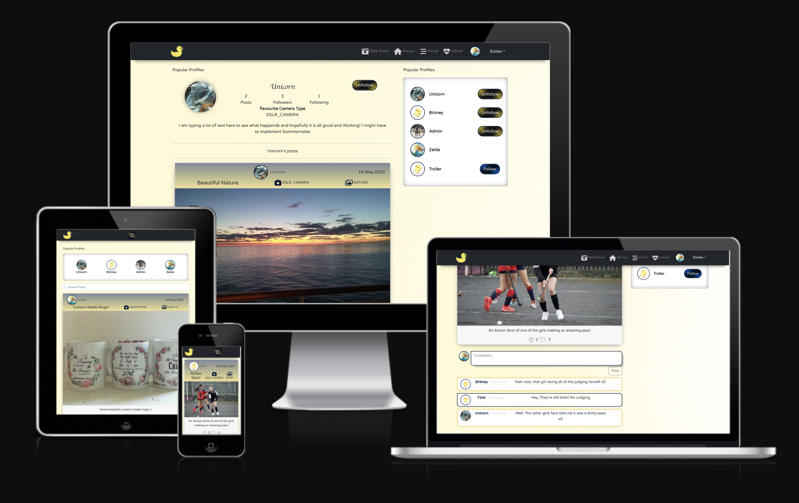

# QuackyGraphy

---

Quacky-Graphy is a social platform website where users can post their awesome Pictures they have taken with thier cameras. Users can upload their professional pictures and give details about the pictures. 

You can View the Live website [By Clicking Here!](https://pp5-quackygraphy-app.herokuapp.com/)

## Links to the Back-End Project

- [Backend - Repository](https://github.com/Quack842/pp5-drf-api)
- [Backend - Deployment](https://pp5-quackygraphy.herokuapp.com/)

## Table of Contents
  1. [Project Goals](#project-goals)
  1. [User Experience](#user-experience)
      - [Target Audience](#target-audience)
      - [User Requirements and Expectations](#user-requirements-and-expectations)
      - [User Stories](#user-stories)
      - [Site Owner Stories](#site-owner-stories)
  1. [Technical Design](#technical-design)
      - [Colours](#colors)
      - [Fonts](#fonts)
      - [Wireframes](#wireframes)
  1. [Technologies Used](#technologies-used)
      - [Coding Languages](#coding-languages)
      - [Frameworks and Tools](#frameworks-and-tools)
      - [NPM Packages / Dependencies](#npm-packages--dependencies)
  1. [Features and Pages](#features-and-pages)
  1. [Validation](#validation)
      - [JSX Validation](#jsx-validation)
      - [CSS](#css-validation)
  1. [Testing](#testing)
      - [Device Testing](#device-testing)
      - [Browser Compatibility](#browser-compatibility)
      - [Manual Testing](#manual-testing)
  1. [Bugs](#bugs)
  1. [Deployment](#deployment)
      - [Heroku](#heroku)
      - [Forking GitHub Repo](#forking-the-github-repository)
      - [Clone a GitHub Repo](#clone-a-github-repository)
  1. [Credits](#credits)
  1. [Acknowledgements](#acknowledgements)

# Project Goals

The Goal of this project was to build a Social Media Platform based website so users can upload their best shot pictures they have taken with their professional cameras, or even their smartphone! The user can show which camera they used and what category the shot was based on.

<u>The key functionality of the Website:</u>

- The website should be simple and easy to navigate across all the pages.
- User Authentication so users can't edit other users profiles, posts and comments.
- User interaction via posts, comments and profiles
- Users to have their own profiles with a brief description, profile image and their preferred camera that they like to use.
- CRUD functionality for posts, comments and their profile.
- Posts can be filtering by keyword search of profile name, camera_type and photo_type
- Responsiveness to allow pleasant usage of the app across a range of devices with varying display sizes

# User Experience

## User Requirements and Expectations
- A site which provides a high level of interactiveness between users
- Links and functions to act as expected
- Notification to provide feedback on expected function outcomes
- Simple "to the point" content that a user can easily digest
- Accessibility for impaired users
- Responsiveness to allow pleasant use across devices of different screen sizes 

## User Stories
[Back to top ⇧](#quacky-graphy)  
[Table Of Contents ⇧](#ta)

I have included links to the [GitHub Issues](https://github.com/Quack842/pp5-quackygraphy/issues) for this project, as well as the [KANBAN board](https://github.com/users/Quack842/projects/4). There are multiple Coloumns that I added other than the default "Todo", "In Progress" and "Done" and their reason/uses are as follow:
 1. Maybe Add
    - Ideas I got while creating the app I would put in this coloumn. Or Ideas that people have suggested afterwards. The issues places in this column was not a priority and I could work on these after I had time.
2. Buggy
    - This Column was created so I can log any errors or bugs to this issue that I have noticed or what other people have noticed while testing the site for me.
3. Dropped
    - This Column was created for the features I thought I wanted to add, but at the end of the project, decided to drop the issue. Some of the Issues that was also added at the "Maybe Add" was moved to the "Dropped" column.

## Site Owner Stories
30. As the site owner, I would want to validate users' data entries on sign up so that users can create a log in which meets the requirements.
31. As the site owner, I would want to ensure only logged in users can post from their account and edit their profile so that data privacy is ensured.
32. As the site owner, I would want to have the ability to remove posts and posts comments so that I can keep the app clean and friendly.
33. As the site owner, I would want the site to be fully responsive so that users can use it across multiple devices and create a good user experience.
34. As the site owner, I would want to use the app search function so that I can search for particular post by their title, camera_type, photo_type and Username.

# Technical Design
[Back to top ⇧](#quacky-graphy)  
[Table Of Contents ⇧](#table-of-contents)

## Colors
The Color Scheme was based of the Main Dukky Icon. I started with the Yellow and used [Coolers Palette generator](https://coolors.co/) to generate complementary colors.

## Fonts
Google Fonts were implemented on the website and [FontJoy](https://fontjoy.com/) was used to generate compatible fonts that will work well together.
- Coiny - Used for importand text and Big Fonts
- Shadows Into Light - For Big Main Fonts (To make a statement)
- Varela Round - Was used for all other fonts

## Wireframes
CorelDraw was used to create wireframes of the sites pages, as I am personally more use to using This application.
After starting with the website, I made a few changes like the design but the color scheme and base design stayed the same more or less. There wasn't really a design for the mobile devices, but It was kept in mind while development. The design for the comment section also came to me while developing the website, I knew that I wanted to have a chat bubble effect that changes color for every second comment. This was the final design for the comments:

Wireframes

## Register Page

## Login Page

## Home Page

## Add Post Page

## Liked Page

## Account/Profile Page

## Edit Profile Page

## Edit Password Page

## Edit Username Page

# Technologies Used
[Back to top ⇧](#quacky-graphy)  
[Table Of Contents ⇧](#table-of-contents)

## Coding Languages

- HTML
- CSS
- Javascript
- React

## Frameworks and Tools

- [Axios](https://axios-http.com/docs/intro) - Axios is a Promise API. Justification: I used axios to send API requests from the React project to the API and avoid any CORS errors when sending cookies.
- [JWT](https://jwt.io/) - Library to decode JSON Web token. Justification: I used JWT to securely transmit data and to have the ability to verify that the content has not been tampered with.
- [React 18](https://react.dev/blog/2022/03/29/react-v18) - JavaScript library for building user interfaces. Justification: To be able to showcase my newly learnt skills and for building interactive user interfaces quickly.
- [React-Bootstrap 2.7.2](https://react-bootstrap.github.io/) - CSS framework. Justification: I used Bootstrap React library for UI components, styling and responsiveness.
- [React Infinite Scroll](https://www.npmjs.com/package/react-infinite-scroll-component) - React library. Justification: I used this component to load content (tasks/comments/users) automatically as the user scrolls towards the bottom of the page without having to jump to next/previous page.
- [React Router](https://v5.reactrouter.com/web/guides/quick-start) - Javascript framework for routing. Justification: I used this library to enable navigation between views of components and to have the ability to control what is presented to the user based on the URL they have accessed in the browser.
- [Am I Responsive](http://ami.responsivedesign.is/) - Website responsive test site. I used this to create the multi-device mock-up at the top of this README.md file
- [CorelDraw](https://www.coreldraw.com/en/?link=wm) - Designers Application. I used this to create the projects wireframes
- [Chrome dev tools](https://developers.google.com/web/tools/chrome-devtools/) - I used this for debugging of the code and checking site for responsiveness
- [Cloudinary](https://cloudinary.com/) - File storage. I used this to store static files
- [Font Awesome](https://fontawesome.com/) - Icon library. I used this to style the site with icons.
- [Google Fonts](https://fonts.google.com/) - Font library. I used this to import fonts
- [GitHub](https://github.com/) - Cloud based hosting service. I used this as a remote repository to store project code
- [Gitpod](https://gitpod.io) - Cloud development environment. I used this to host a virtual workspace
- [Code Anywhere](https://codeanywhere.com/) - Cloud development environment, it is simular to Gitpod. Used this when my credits ran out on GitPod
- [VS Code](https://code.visualstudio.com/) A Source Editor. When Code Anywhere failed me (Like many others) I decided to move all mo code to VS Code.
- Validation:
  - [WC3 Validator](https://validator.w3.org/) - HTML Validator. I used this to validate the applications HTML code
  - [Jigsaw W3 Validator](https://jigsaw.w3.org/css-validator/) - CSS Validator. I used this to validate the applications CSS code
  - [ESLint](https://eslint.org/) - JavaScript Validator. I used this to validate applications JSX code
  - [Lighthouse](https://developers.google.com/web/tools/lighthouse/) Site auditing tool. I used this to validate performance, accessibility, best practice and SEO of the application
- [Gif Creator](https://imgflip.com/gif-maker) This website was used to make my image, that is on the "Page not Found", from 3 png images to 1 gif image.
- [Background Generator](https://app.haikei.app/) This website was used to generate the page background and the button's backgrounds.
- [CSS Box Shadow Generator](https://cssgenerator.org/box-shadow-css-generator.html) This website was used to generate a box shadow that was used through out the code.
- [StackOverflow](https://stackoverflow.com/) This website was used to help fix bug and errors that showed up during development.

## NPM Packages / Dependencies
There was a few dependencies that was installed during development, but was not used because I changed my mind on the feature.

| Package | Version | Used |
| --- | --- |---
| axios |1.3.6 | 
| bootstrap | 5.2.3 | 
| jwt-decode | 3.1.2 | 
| emoji-picker-react | 3.1.2 | 
| react-bootstrap | 1.6.3 | 
| react | 18.2.0 |
| react-dom | 18.2.0 |
| react-infinite-scroll-component | 6.1.0 |
| react-infinite-scroller | 1.2.6 | 
| react-loader-spinner | 5.3.4 |
| react-password-checklist | 1.4.3 | 
| react-password-strength-bar | 0.4.1 |
| react-router-dom | 6.10.0 |
| react-scripts | 5.0.1 |
| web-vitals | 2.1.4 |

# Features and Pages
[Back to top ⇧](#quacky-graphy)  
[Table Of Contents ⇧](#table-of-contents)

In its entirety the website consists of a variety of features across the many site pages as listed below.

## Navigation
The Navigation bar in the mobile size has an offcanvas design for the menu bar instead of the deafult dropdown feature. The Offcanvas feature will also close when a user choose any of the tabs.

Navigation Bar On Desktop - Not Signed In

Navigation Bar On Desktop - Signed In

Navigation Bar On Mobile - Not Signed In

Navigation Bar On Mobile - Signed In

## Register Page

This Page will give the user the option to create an account. The Registration Page has a "Password Strength bar".

Password Too Short

This will show while the password is under 8 characters.

Password Weaksause

Password Still Weak

Password A Little Better

Password Guess That Will Do

Password Unbreakable

## Sign In

When the user Log In, after creating an account, Their user user details should be saved and the browser will remeber the user so they don't have to sign in everytime.

## Home page

Home page is where users, Signed in or not, can view all the posts that users have posted. If the user is not Signed In, they will not be able to like, comment, reate a post or Follow/Unfollow other Users.

Home Page Image - Signed Out

Home Page Image - Signed Out - Like Icon

Home Page Image - Signed In

Home Page Image - Signed In - Like Icon

Home Page Image - Liked

When the user is signed in and likes another users post, there will be a pop message on the top right corner of the page, letting the user know that they have liked a post.

Home Page Image - Signed In - Follow/Unfollow

When the user is signed in, they will also have the option to follow and unfollow other users.

## FYP (For You Page)

The FYP Page can only be viewed if the user is signed in. This is the page where users can few all the posts of poeple they follow.

FYP (For You Page)

## Liked Page

The Liked page can only be viewed by signed in users. This page Is for users to see all the posts that that liked.  

Liked Page

## Profile Page

The Account page is where the user (If logged in) can view and edit their profile. It is also where they can change their Username and Password. Users that Aren't Signed In can also view other profiles, but they would not be able to follow/unfollow that user.

Profile Page - Signed In

Other Users Page - Signed In

Profile Page - Edit Menu

Profile Page - Edit Page

Profile Page - Username Change

Profile Page - Password Change

Profile Page - Signed Out

## Posts

This is where the User (Logged In) Will be able to create a post. The user will also be able to edit and delete the post, there will be a Warning Modal to ask if the user is sure they want to delete the post.

Add A Post

Create A Post Post

Edit/Delete Post Button

Edit Post Page

Delete Post Warning

## Comments

Non-Logged in users will be able to few the comments but will not be able to create, edit or delete any comments. Users that are logged in will be able to Add, Edit and Delete their own Comments. Before a comment is deleted, the user will be asked if they are surethey want to delete the comment with a pop-up modal.

Comment Button On Post

Comment View - Non Logged In

Comment View - Logged In User

Comment View - Logged In User - Active

When the user start typing a comment, the "Post" button will activate.

Comment Edit - Edit Dropdown

Comment - Edit

Comment - Delete

## Posts Search

This Search Feature is on the Home, FYP and Liked Pages. This feature allow the user to search for a post, or posts, my Username, Post Title, Camera Type or Photo Type.

Search Bar - None

Search Bar - Username

Search Bar - Title

Search Bar - Camera Type

Search Bar - Photo Type

## Page does not exist

When the user tried to access a page that doesn't exist, they will get a "Page Does not exist" page.

Page Not Found

 

# Validation
[Back to top ⇧](#quacky-graphy)  
[Table Of Contents ⇧](#table-of-contents)

## JSX Validation

The JSX code was validated during the development process and corrected as the project proceeded. 

## CSS Validation

I Checked the CSS syntax at the W3C CSS Validator Service and the results revealed no errors

# Testing
[Back to top ⇧](#quacky-graphy)  
[Table Of Contents ⇧](#table-of-contents)

## Chrome Dev Tools Lighthouse Validation

### Desktop 

Results

  

  
Home Page

  The Performance of the lighthouse is at 58. According to the scoring, it is because of the image sizes. Because this is a website for professional photographers, the image size is set for no more than 8MB. The same will show through all the lighthouse tests

  
  
  
  
  

  

  
Regitser Page

  
  

  

  
Sign In Page

  
  

  

  
FYP Page

  
  
  

  

  
Liked Page

  
  
  

  

  
Profile Page

  
  
  

  

  
Add Post Page

  
  

  

  
Edit Post Page

  
  

## Device Testing

This site was tested on the following devices:
- Windows 10 PC
- MacBook Pro
- iPhone 12 Pro
- iPad Tablet 8"
- Android

## Browser Compatibility

The website was tested on the following web browsers:
- Google Chrome
- Bing
- Safari
- Brave
 
## Manual Testing

### Home Page
As shows in the Features Section, The user wont be able to add, edit, like or delete any posts if they dont have an account.

Register Page

| Features | Expected Result | Screenshot | Pass/Fail |
| --- | --- | --- | --- |
| Home | New Posts Load when the user scrolls down | N/B |  |
| Register Page | When the user leaves empty Fields |  |  |
| Register Page | When the username already taken |  |  |
| Register Page | When the password not match |  |  |
| Register Page | When the password is too common |  |  |
| Register Page | When the password is only numbers |  |  |
| Register Page | When the password is too short |  |  |

Sign In Page

| Features | Expected Result | Screenshot | Pass/Fail |
| --- | --- | --- | --- |
| Sign In Page | When the user leaves All Fields Empty |  |  |
| Sign In Page | When the username fields is empty |  |  |
| Sign In Page | Wehn the wrong pass is entered |  |  |

# Bugs
[Back to top ⇧](#quacky-graphy)  
[Table Of Contents ⇧](#table-of-contents)

| **Bug** | **Fix** | **Image** |
| --- | --- | --- |
| When user upload invalid image type, then change the image, the error message does not go away | I Fixed it by adding extra code that in the PostCreateForm, as shown in the Image |  |
| The Form for the Create and Edit Forms looked "Wonky" when used on a mobile | I Changed the stying of Col span. The Image shows the Bug |  |

There was a Few More Errors and Bugs, but unfortunatly I didn't document them all because typically when I code, I fix the problem while coding, these bugs that I list Here, Was suggested/shows by People I asked to help test my website

The other Bugs is Mentioned in the [Credits](#credits) Section as it was bugs and errors, but It was Thanks to these articles that I could Fix them.

# Deployment
[Back to top ⇧](#quacky-graphy)  
[Table Of Contents ⇧](#table-of-contents)

## Cloning a Template

1. Go to the [Template](https://github.com/Code-Institute-Org/gitpod-full-template) your cloning from
2. Click on the "Use This Template" dropdown
3. Within the Dropdown, Click on "Create a new repository"
4. Give your new repository a cool name.
5. Click on the green "Create repository from template"

## Running in VS Code
1. Open VS Code
2. Log into your Github account
3. On the lefthand side, click on the Source Control Icon

4. After Clicking on the "Clone Repository" button, all of your puplic repositories will appear on the top url bar.

5. Open your newly created repository and happy coding!

<b>Just note!!</b>
If you work on a Cloud IDE like Code Anywhere or Gitpod after commiting and pushing from VS Code, to insure you get all the latest code, first run "git fetch" and then "git pull" in the terminal. When you continue working on the VS Code again, run the same two commands.

## Deploying With Heroku
1. Log into [Heroku Dashboard](https://dashboard.heroku.com/)
1. Click on the "New" dropdown
1. Click on "Create New App"
  - 
1. Insert a cool for your project in the "App Name" box
1. Change the Region to Europe
1. Click on "Create App"
  - 
1. <b>IMPORTAND!!</b> Heroku loves adding exrta add-ons, so remember to remove those after creating a new app.
1. Go to the "Deploy" tab and Connect your Github repository
1. Click on "Deploy Branch"
1. Now Checkout Your Live website!
  - 

# Credits
[Back to top ⇧](#quacky-graphy)  
[Table Of Contents ⇧](#table-of-contents)

- Main credit goes to Code Institute Tutorial Project, used through as a basis for the creation of this API. Originally wanted to build an app based around dungeon and dragons and the type of players they can build, but unfortunalty, I'm away for 2 weeks before my upload deadline. So I kept it simple.

- The Following StackOverflow articles helped me figure out a few problems I ran into whilst Developing:
  1. In The App.js file, the follow along tutorial used the <Switch></Switch>, but that didn't work in my Project since I use a newer version of React. This article Helped me fix that problem.
    - [StackOverdlow Helper 1](https://stackoverflow.com/questions/53972254/react-router-switch-not-working-as-expected)
  2. The Links used in the App.js file for the "Page Not found", didn't work following the Walkthrough. This article helped me fix the problem.
    - [StackOverdlow Helper 2](https://stackoverflow.com/questions/67050966/how-to-build-a-404-page-with-react-router-dom-v6)
  3. I struggled with this one for a long while, because I didn't know that the useHistory is not used in the newer version. This article was the biggest help off all! Because even the tutors tried heling but because most students keep using the older version used in the walkthough, they didn't know what was wrong ether.
    - [StackOverdlow Helper 3](https://stackoverflow.com/questions/63471931/using-history-with-react-router-dom-v6)

# Acknowledgements

- The tutor support was phenomenal, as always, at helping me fix my all my problems (Coding that is). 